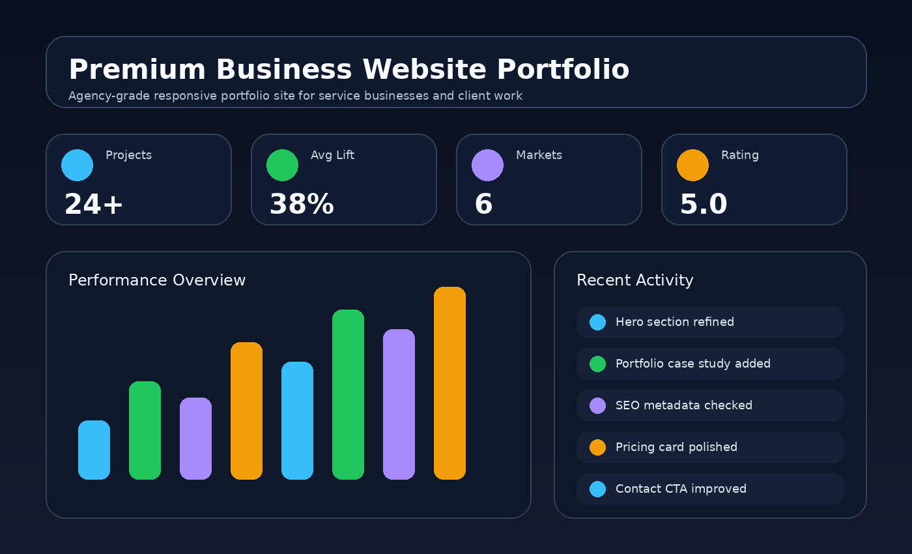

# Premium Business Website Portfolio

> A polished business website portfolio project for agencies, consultants, service businesses, and local brands that need premium front-end presentation.

Built by **Arsim Shefkiu** under **FullStackWithAI** — full-stack, AI-assisted, and data-driven web solutions.



## Overview

A premium multi-section business website template designed to showcase client-facing web design ability. It includes a strong hero, services, portfolio cards, testimonials, pricing, and contact CTA.

## Why this project exists

This repository is designed to be visible and understandable to recruiters in the first 30 seconds. It shows practical product thinking, clean front-end structure, responsive UI execution, and business/data awareness.

## Features

- Luxury-style landing page for service businesses
- Portfolio/project cards with case-study style copy
- Pricing and service packages section
- SEO-friendly semantic structure
- Responsive design with polished visual hierarchy

## Tech Stack

- HTML5
- CSS3
- Vanilla JavaScript
- Responsive layout
- Mock dataset / client-side interactions

## Project Structure

```text
premium-business-website-portfolio/
├── index.html
├── assets/
│   ├── styles.css
│   ├── app.js
│   └── screenshot.png
└── README.md
```

## How to Run

Open `index.html` directly in your browser, or run a simple local server:

```bash
python -m http.server 5173
```

Then open:

```text
http://localhost:5173
```

## Recruiter Notes

This project is intentionally built as a polished portfolio piece. It demonstrates:

- UI/UX judgment
- Responsive front-end implementation
- Business dashboard thinking
- Clean file organization
- Ability to turn an idea into a product-like interface

## Future Improvements

- Convert to React components
- Add API data loading
- Add authentication and protected routes
- Persist data in a database
- Add automated tests

## About

Built by **Arsim Shefkiu** under **FullStackWithAI** — Full Stack Web Developer & AI-Assisted Builder specializing in AI-powered web products, dashboards, automation tools, and modern portfolio-ready applications.

- 🌐 [designhubmk.com](https://www.designhubmk.com)
- 📧 info@designhubmk.com
- 💼 [LinkedIn](https://www.linkedin.com/in/arsim-shefkiu-78432a3b5)
- 🐙 [GitHub](https://github.com/fullstackwithai)
